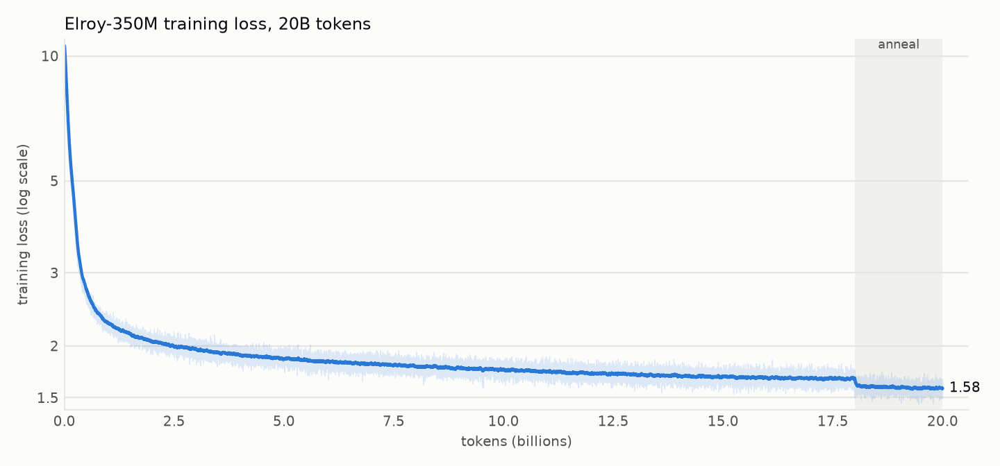
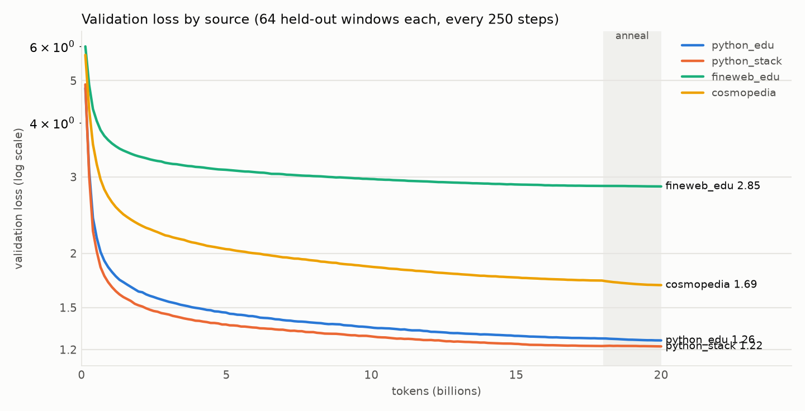
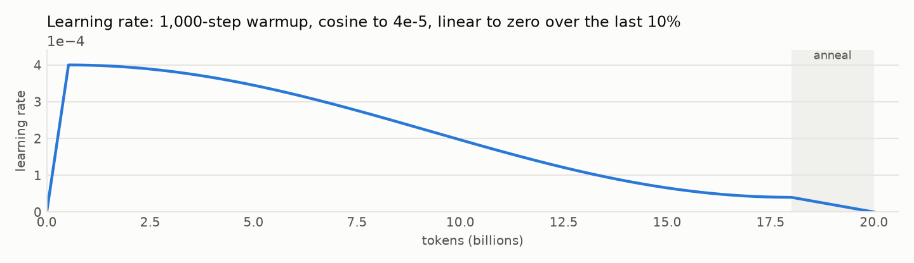

# Chapter 5: The run

By the end of this chapter you have seen what six days of training actually look like: the curves, the two things that broke, and what the model can and cannot do at the end of it, measured rather than described.

## The shape of it

Elroy-350M trained from 4:56 PM on Sunday, September 14 to 4:17 PM on Sunday, September 20: 38,146 optimizer steps, 20.0B tokens, a mean of 13.46 seconds per step at 69.1% MFU, 17.3GB per GPU. Both cards sat at 100% utilization and 79 to 82C the entire time. The wall time includes one restart that cost 25 minutes and is described below.



The training loss goes from 10.58 (which is `ln(32768)`, the loss of a uniform guess over the vocabulary, plus a little) to 1.58. The curve has the shape every language-model run has: a cliff in the first 500M tokens where the model learns the tokenizer's statistics and the shape of Python, then a long slow descent that never quite flattens. The smoothed loss was 2.27 at 1B tokens, 1.86 at 5B, 1.76 at 10B, 1.69 at 15B and 1.67 at 18B. The step down at 18B is not learning; it is the data mix switching to the anneal mix, which is 60% Stack-Edu, the easiest source. Training loss is only comparable with itself while the mix is constant, which is one reason the per-source validation loss is the number to watch.



Four curves, four stories. The two Python sources end at 1.26 (Stack-Edu) and 1.22 (StarCoderData) and are nearly parallel the whole way; a 350M model finds the two about equally hard, and StarCoderData a little easier because it has more boilerplate. Cosmopedia's synthetic textbooks end at 1.69: written to a template by a model, they are predictable in a way real text is not. FineWeb-Edu ends at 2.85 and was still dropping at a visible slope when the run ended, which is the curve that says "this model would keep improving at English with more tokens" and also "this model is not an English model." That was the plan.

None of the four curves is flat at 20B tokens. The plan left the door open to continue to 30B if that was the case, and it is; the reason not to is Chapter 7. The chat model is what people will use, the base model's benchmark numbers below are already in the range the plan targeted, and the marginal 10B tokens are three more days of both GPUs. The 20B checkpoint is the release.



The learning-rate schedule did what Chapter 4 said it would. The anneal (the last 10% of training, learning rate linearly to zero while the mix shifts) bought 0.013 on Stack-Edu validation loss, 0.002 on StarCoderData, 0.008 on FineWeb-Edu and 0.041 on Cosmopedia. Small numbers, but they are the difference between the last 2B tokens being worth something and being worth nothing: the cosine tail before it had been improving Stack-Edu by about 0.01 per 2B tokens. The Cosmopedia gain is the largest because Cosmopedia went from 10% of the mix to 25%.

Gradient norms were quiet. The largest was 9.06 at step 620, during warmup; the median over the run was 0.16, and after warmup the norm exceeded 1.0 (the clipping threshold) on only 6 of 37,146 steps. No loss spikes, no divergence, nothing to restart from a milestone for. This is what a run at a conservative learning rate on a well-cleaned corpus looks like, and it is the reason to spend the time in Chapter 1.

## What broke

Two things, both on day 2, both in code that had been tested at the mini scale and not at the real one. Chapter 4 has the details; the short version is here because it is part of the run.

The milestone checkpoints (a permanent copy every 5B tokens) never fired. The check asked whether the current step had crossed a 5B boundary, but checkpoints are only written every 250 steps and 5B tokens is step 9,537, so the condition was never true on a step that wrote one. Noticed at step 12,864, when the 5B copy was not there. Fixed to "first checkpoint past each boundary"; the 6.7B checkpoint stands in for 5B and the 10B and 15B copies were taken correctly.

Applying that fix meant a restart, and the restart ran one step and died with CUDA out of memory. The checkpoint was being loaded straight onto the GPU, where it sat as a second 4.3GB copy of the model and optimizer state next to the live one. The mini config resumes fine that way because it is small. Loading to CPU and dropping the dict fixed it. Total cost of both: 25 minutes and a paragraph.

What did not break: the data loader never wrapped a source, DDP never hung, the box never OOMed on the host side, and the resumed run reproduced the pre-restart loss at step 13,001 to four decimal places, because the loader position and RNG state are in the checkpoint.

## What it can do

`scripts/sample_base.py` runs a fixed set of prompts through a checkpoint at temperature 0.2. The full output is in `results/base/samples.md`; these are the ones that matter.

Given a signature and a docstring, it writes the function:

```python
def is_prime(n: int) -> bool:
    """Return True if n is a prime number."""
    if n == 1:
        return False
    if n == 2:
        return True
    if n % 2 == 0:
        return False
    for i in range(3, int(n ** 0.5) + 1, 2):
        if n % i == 0:
            return False
    return True
```

That is correct, idiomatic, and includes the odd-only optimization. Reversing a linked list came out textbook-correct too, with the `prev, curr, next` three-pointer walk. Fill-in-the-middle works: given the top and bottom of a fizzbuzz loop, it produced the `if/elif` chain for the middle (and dropped the final `else`, because the suffix it was given already contained the fallthrough line at the wrong indentation, which is an honest reading of a slightly broken prompt).

And here is the failure that matters most, unedited:

```python
def word_counts(text: str) -> dict[str, int]:
    """Count how many times each word appears in text, ignoring case."""
    return {word: text.lower().count(word) for word in text.split()}
```

It looks right. It is wrong twice: `str.count` counts substrings, so the word "a" is counted inside "apple", and the dictionary keys are not lowercased while the text is. It would pass a casual glance and fail the second test anyone wrote. The CSV example has the same property: it uses `csv.reader` and then indexes a row by column name, which only works with `DictReader`. These are the errors of a model that has seen the shape of the answer thousands of times and has no way to run it.

English is where the size shows. Asked to continue "The city of Providence, Rhode Island, is", it wrote that Providence is the largest city in the United States and the tenth largest in the world, and then repeated that sentence, with variations, for 200 tokens. Confident, fluent, wrong, and looping. Asked a question in prose ("Write a Python function that checks whether a number is prime"), it did not write the function; it wrote a comment explaining what a prime number is and stopped. It has never seen an instruction followed by an answer, only text followed by more text. That is the gap Chapter 7 closes.

## The benchmarks

`scripts/eval_code.py` runs three standard code benchmarks: HumanEval (164 problems, function signature plus docstring, hidden tests), HumanEval+ (the same problems with about 80x more tests, which catches solutions that only pass the easy cases) and MBPP (257 sanitized problems, a one-line task description plus three example tests). Greedy decoding, one attempt, a 10-second timeout and a 4GB memory limit per problem. pass@1 is the fraction that passed.

| Benchmark | Elroy-350M base, pass@1 |
|---|---|
| HumanEval | 13.4% (22 of 164) |
| HumanEval+ | 11.0% (18 of 164) |
| MBPP (sanitized) | 20.2% (52 of 257) |

Read the HumanEval number with its structure. The 22 passes are all in the first 61 problems; from problem 61 on the model got nothing. HumanEval is roughly ordered by difficulty, and the model's competence has a sharp edge: string filtering, GCD, list comprehensions, simple loops, yes; anything that needs two ideas held at once, no. Of the 142 failures, 105 were wrong answers (the code ran and the assertion failed), 15 were syntax errors (mostly a completion that hit the 384-token limit mid-statement), and the rest were name, type and recursion errors. Wrong-but-runnable is the dominant failure, which is the same thing the `word_counts` sample showed.

MBPP is higher because its problems are shorter and its prompts include the test cases, so the model can see the expected call shape. Its failures split the same way: 125 wrong answers, 35 syntax errors, 24 `NameError`s (the model called a helper it never defined, or used the wrong function name from the tests).

HumanEval+ needed a second run. The first pass came back at 3.0% and the failure log said why: 14 of the 22 solutions that pass HumanEval died with `MemoryError`, because HumanEval+'s test files carry tens of thousands of generated cases and our sandbox capped the subprocess at 1GB. That is a harness bug, not a model result, and it is the kind of number that gets published if nobody reads the stderr. With the limit raised to 4GB the real number is 11.0%: 18 of the 22 HumanEval passes survive the extra tests, and the 4 that do not are the ones that only handled the cases the docstring happened to show. An 18% relative drop from HumanEval to HumanEval+ is in the normal range for models that were not tuned on the benchmark.

`results/base/` has every completion and every error, so anyone can check the above rather than take it.

## Where that lands

The plan said a 350M model trained on 20B tokens of mostly Python should land in the range of the early code models. GPT-2 (2019) could not write a working function at all. Codex 12B (2021), the model behind the first GitHub Copilot, scored 28.8% on HumanEval; its 300M variant scored 13.2%. SantaCoder 1.1B (2022) scored about 18%. Elroy at 13.4% with 360M parameters is where a small model with a good tokenizer, clean data and 2026 training practice should be: roughly Codex-300M territory, on a workstation, in six days.

## Next

Chapter 6 covers the sampler that produced everything above. Chapter 7 teaches the model to answer a question instead of continuing it.
